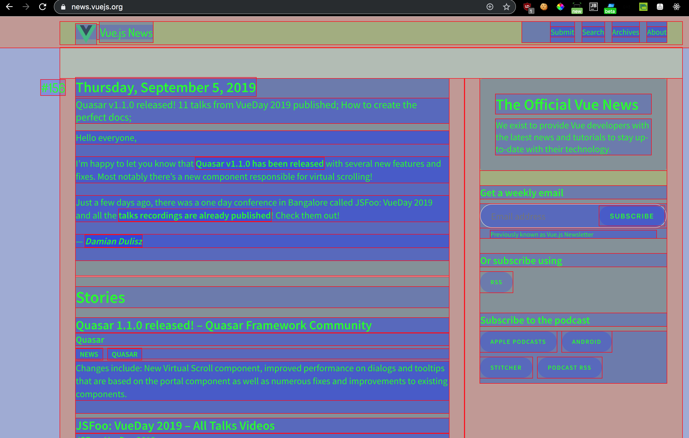

לפעמים, כשאנו מתחילים לבנות את מבנה דף ה HTML שלנו, היינו שמחים אם היה כלי עזר כלשהו שהיה יודע לסמן עבורנו את האלמנטים השונים בדף.

אמרתם DevTools? כן, משהו כזה... אבל מה לגבי סימון ההירכיות שלהם? ואפשרות לראות הכל תוך כדי בנייה בלי לסמן כל אלמנט?

שימו לב לקוד ה CSS הבא:
```css
* { background-color: rgba(255,0,0,.2); }
* * { background-color: rgba(0,255,0,.2); }
* * * { background-color: rgba(0,0,255,.2); }
* * * * { background-color: rgba(255,0,255,.2); }
* * * * * { background-color: rgba(0,255,255,.2); }
* * * * * * { background-color: rgba(255,255,0,.2); }
* * * * * * * { background-color: rgba(255,0,0,.2); }
* * * * * * * * { background-color: rgba(0,255,0,.2); }
* * * * * * * * * { background-color: rgba(0,0,255,.2); }
```

הקוד די מדבר בעד עצמו - צביעה של כל אלמנט עפ״י דרגתו ההיררכית בדף

ומה אם נרצה להחיל את העיצוב הנ״ל על אתר קיים?

אז מסתבר שקיימת אפשרות להוסיף קוד JavaScript שיכניס את העיצוב הזה בעזרת ״סימניה״ לכרום.
מה? תראו:

כנסו לתפריט של גוגל כרום (3 נקודות אנכיות) ובחרו ב Bookmarks -> Bookmarks Manager
והוסיפו Bookmark חדש עם שם כלשהו ואת הכתובת הבאה בשדה ה URL:

```javascript
javascript: (function() {
	var styleEl = document.getElementById('css-layout-hack');
	if (styleEl) {
		styleEl.remove();
		return;
	}
	styleEl = document.createElement('style');
	styleEl.id = 'css-layout-hack';
	styleEl.innerHTML = '* { background:#000!important;color:#0f0!important;outline:solid #f00 1px!important; background-color: rgba(255,0,0,.2) !important; }\
    * * { background-color: rgba(0,255,0,.2) !important; }\
    * * * { background-color: rgba(0,0,255,.2) !important; }\
    * * * * { background-color: rgba(255,0,255,.2) !important; }\
    * * * * * { background-color: rgba(0,255,255,.2) !important; }\
    * * * * * * { background-color: rgba(255,255,0,.2) !important; }\
    * * * * * * * { background-color: rgba(255,0,0,.2) !important; }\
    * * * * * * * * { background-color: rgba(0,255,0,.2) !important; }\
    * * * * * * * * * { background-color: rgba(0,0,255,.2) !important; }';
	document.body.append(styleEl);
})();
```

כעת, בחרו אתר מעניין, כנסו אליו ואז בחרו בסימניה שיצרתם.

הנה התוצאה המרהיבה:


איך זה עובד? 
הביטוי javascript עם נקודותיים לאחריו בשורת הכתובת פשוט מפעיל קוד ג׳אווה-סקריפט על הדף הנוכחי... זה הכל...

מוזמנים לשתף בתגובות ב CSS Hacks נוספים ומגניבים במיוחד

כל הקרדיט לפוסט 
[הזה](https://dev.to/gajus/my-favorite-css-hack-32g3)
