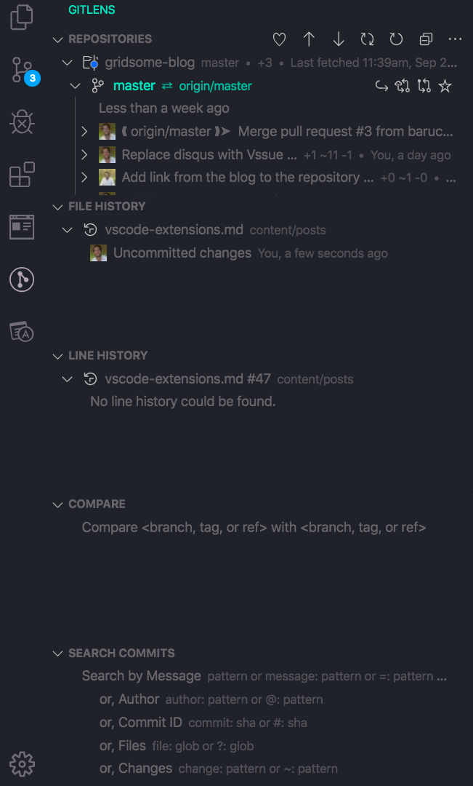
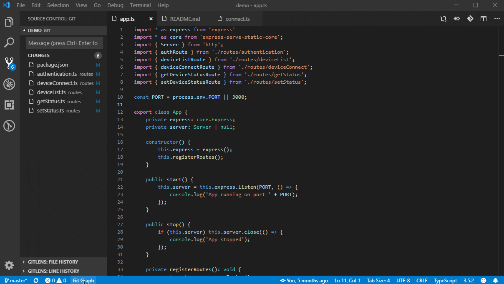
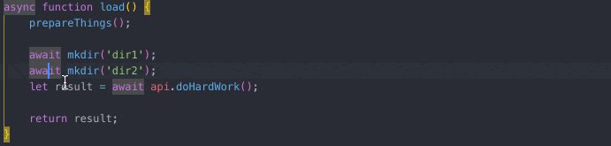
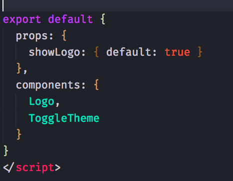
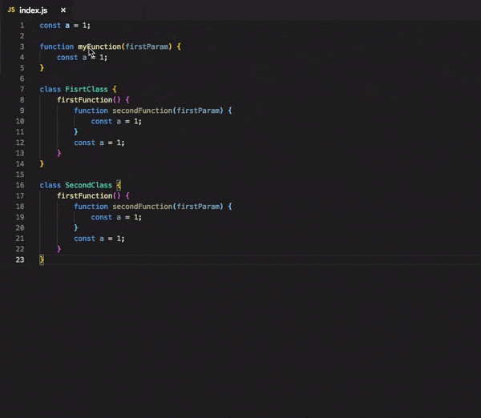
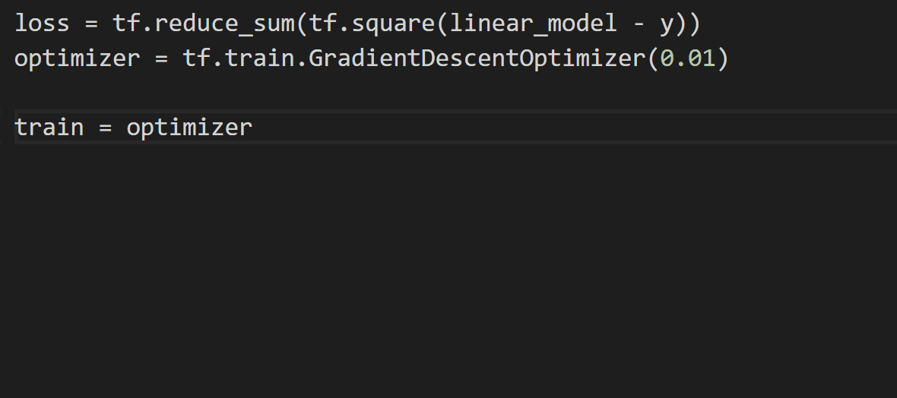
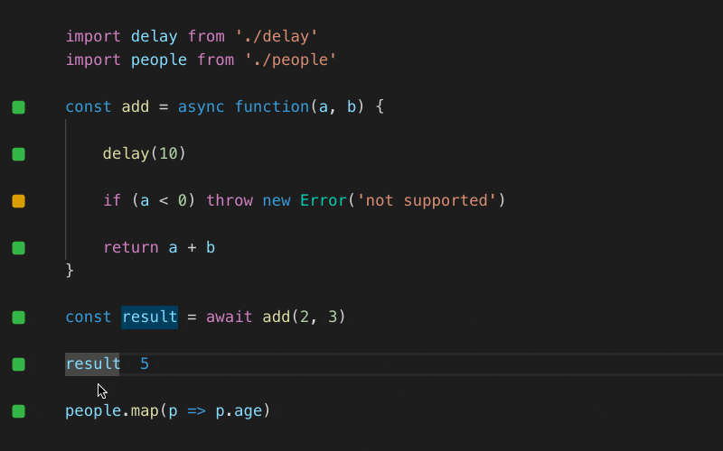
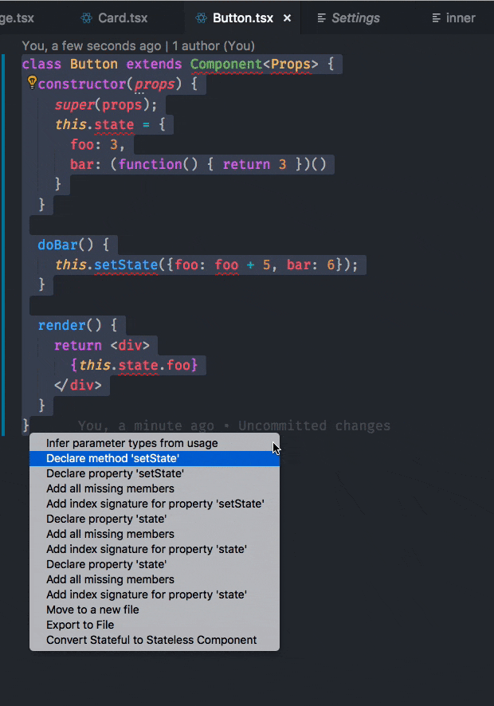
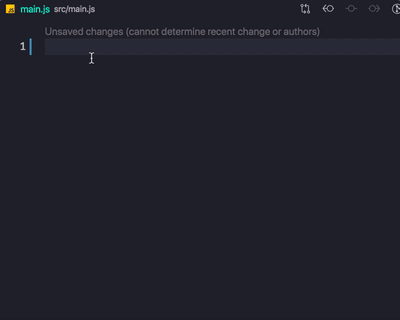
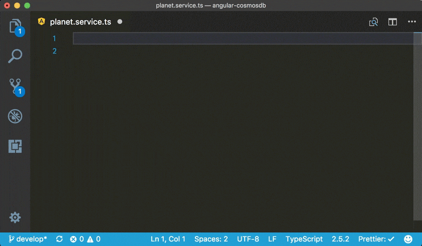

אחד מהיתרונות הגדולים ביותר של VSCode על פני עורכי טקסט או IDEs הוותיקים ממנו בשוק הוא ההיצע המדהים של תוספים - Extensions - שפותחו עבורו, והופכים אותו תוך שניות לכלי רב עוצמה.

במאמר הזה אנסה לסקור את האפקטיביים יותר, לפחות עבורי, ובתקווה שגם עבורכם.

# התקנת התוספים
התקנת התוספים מאוד פשוטה - כניסה לחלק ה Extensions בתפריט הצד, חיפוש התוסף ו Install.

לאוהבי הקיצורים: 

Ctrl (CMD on MAC) + P -> ext install EXTENSION_NAME 

# ניהול גרסאות
אז ל VSCode יש מנהל גרסאות די בסיסי. מהר מאוד תרגישו שאתם צריכים משהו קצת יותר מתקדם. הנה שניים מומלצים:

## GitLens

```
ext install eamodio.gitlens
```
אחד התוספים הכי מוכרים וחזקים בתחום.
כמה תכונות בולטות:

- "האשמת משתמשי git" לפי שורה

  כל שורה שתעמדו עליה תציג לכם את שם המשתמש האחרון ששינה אותה. אבל למה להיות שליליים? אפשר גם ללכת ולשבח אותו על הקוד המקסים שכתב..

- הצגת ה Repositories, Branches ועוד

  רשימה מלאה של Repositories, Brances (Local and Remote), Contibutors, Tags... בקיצור הכל..



- ההיסטוריה המלאה של כל קובץ ושורה

 הצגה ומעבר בין כל ה commits לקובץ שפתחתם והרלוונטיים לשורה בה אתם נמצאים כעת.

טוב, יש עוד מיליון פיצ׳רים אבל נראה לי שכבר די השתכנעתם...

## Git Graph
מי שקצת יצא לו להתנסות ב Sourcetree - הנה פתרון שאולי ימנע מכם לקפוץ כל פעם בין חלונות ולהשאר ב VSCode...
```
ext install mhutchie.git-graph
```
הצגת כל המידע החשוב שלכם בצורת גרף נאה (או פחות.. תלוי במבנה הגיט שלכם) ומעבר פשוט ונוח בין ה Branches/Commits השונים.

אנימציה קטנה שתסביר הכל:



# כלי עזר לכתיבת/סימון קוד

## JavaScript Booster

מסתבר שיש הרבה שינויי ותיקוני קוד שחוזרים על עצמם ויכולים להתבצע בצורה כמעט אוטומטית ולחסוך לנו הרבה זמן...

כמו למשל:

- הפיכת פונקציה רגילה ל״פונקציית חץ״ (או Arrow Function בלעז)
- שינוי מחרוזת רגילה ל Template String (ES6+) ולהפך
- החלפת var ל const

ועוד ועוד ועוד...

הנה תוסף שיעשה את זה בשבילנו ע״י שימוש ב״מנורה״ או ALT + ENTER:

```
ext install sburg.vscode-javascript-booster
```

והנה הדגמה קטנה של עוד משהו נחמד בהחלט - הפיכת מספר promises לכתיבה של Promise.all על מנת לבצע אותם באופן מקבילי:



## Bracket Pair Colorizer 2

השם אומר הכל. תוסף שמטרתו לצבוע את הסוגריים המופיעים בקוד בצבעים שונים לכל זוג. עוזר המון בהתמצאות במצבים מקוננים למינהם (פונקציה בתוך פונקציה/לולאה.. פלאטר-סטייל ועוד)

שימו לב שזו גרסא 2 המתוחזקת יותר..

```
ext install CoenraadS.bracket-pair-colorizer-2
```



## Turbo Console Log

מכירים את הקטע המעייף הזה של כתיבת console.log כל פעם מחדש עם לייבל מתאים?
החיים גם ככה די קצרים, לא?!

התוסף הזה יעשה הכל בשבילכם בלחיצת CTRL/CMD + ALT + L פשוטה...

```
ext install ChakrounAnas.turbo-console-log
```

והנה הדגמה קצרה שלאחריה אתם רצים להתקין את התוסף:




## TabNine

נכון שהייתם רוצים כלי עזר חכם שיכתוב את הקוד במקומכם?!
טוב, אז הכלי הזה לא את כל הקוד, אבל הוא ילמד אתכם תוך כדי שימוש ויתחיל להציע הצעות רלוונטיות להשלמות של מילים ואפילו משפטים!

מומלץ לתת לו צ׳אנס של ימים-שבועות עד שתתחילו לחוש בכח העצום שלו. לי בכל אופן הוא חוסך הרבה הקלדות חוזרות.

```
ext install TabNine.tabnine-vscode
```

## Microsoft Intellicode

עוד כלי ממש דומה שמשלים מילים - אמנם מילה בודדת אך מגיע מבית טוב.. מומלץ גם כן לתת לו צ׳אנס של כמה ימים עד שתראו הצעות רלוונטיות היישר מיכולת הבינה המלאכותית של מיקרוסופט.

```
ext install VisualStudioExptTeam.vscodeintellicode
```



## Quokka.JS

עכשיו תפתחו חזק את האוזניים... מה דעתכם על כלי שיריץ עבורכם את הקוד תוך כדי כתיבה וגם יראה את התוצאה בצד? נשמע מושלם נכון? הנה משהו אמיתי שעושה את זה:

```
ext install WallabyJs.quokka-vscode
```



מדהים... שימו לב הגרסא החינמית די מוגבלת אבל עושה את העבודה להרצות יחסית קטנות.

דרך אגב, [כאן](https://dev.to/satansdeer/quokka-clone-in-10-minutes-vscode-extention-tutorial-3g1k) תוכלו לקרוא איך ליצור Clone כזה במו ידכם...

## Glean for React.js

```
ext install wix.glean
```

תוסף חזק מבית Wix (ו [Boris Litvinsky](https://twitter.com/borislit) התותח) לביצוע Refactoring לקוד ריאקטי בצורה קלה ומאוד יעילה.

שימו לב לאופציות הבאות:

הוספת תנאי לרנדור:


המרת Component של Class לפונקצייה כולל שימוש ב Hooks:



על מנת להשתמש בפיצ׳ר האחרון צריך להוסיף להגדרות של VSCode את השורה הבאה:
```
"glean.experiments": ["hooksForFunctionalComponents"]
```

# השלמות קטעי קוד (snippets)

כמו בכל עורך טקסט שמכבד את עצמו גם פה תמצאו תמיכה מדהימה בהשלמת קטעי קוד שתוסיף לחיים שלכם המווון זמן!

כאן יש כמובן הרבה מקום לטעם אישי של הצורה בה אתם אוהבים לכתוב...

## JavaScript standardjs styled snippets

```
ext install capaj.vscode-standardjs-snippets
```

תוסף שיוסיף המון המון השלמות שימושיות בג׳אווה-סקריפט.

כמה דוגמאות:

כתבו fl, לחצו על TAB ותקבלו את ההשלמה של לולאת for סטנדרטית ובכל לחיצה נוספת על TAB תוכלו בקלות להשלים את הקטע הרלוונטי (אתחול כניסה, תנאי המשך, תנאי עצירה...)



map -> map function

find -> find function

af -> arrow function

ועוד ועוד... פשוט תתחילו להתרגל לא לכתוב

## Angular Snippets
כל טכנולוגיה והקיצורים שלה..  אנגולר הוא פריימוורק שמשווע לקיצורים. John Papa הרים את הכפפה ונתן לנו את התוסף המדהים הבא:

```
ext install johnpapa.Angular2
```

התוסף כולל קיצורים שמתאימים לגרסא 8.

דוגמאות נבחרות:

a-component -> component

a-service -> service

a-module-root -> module for root




כמובן שכל שפה/טכנולוגיה/פריימוורק וה Sinppetsים שלה...


יש עוד אינספור תוספים נחמדים אבל נראה לי שמספיק להפעם.


החכמתם? יש תוסף שאתם אוהבים והייתם רוצים לכתוב עליו? ספרו בתגובות!